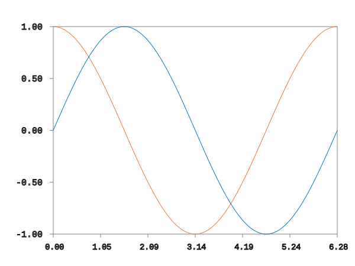
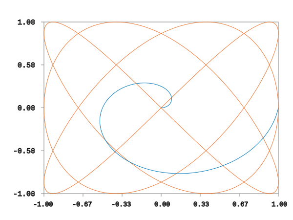

# Fig Plot
A plotting library in Fortran that depends on FIG.

It is still very much a proof of concept, but it allows you to draw basic 2D plots.

### Gallery:
Below are some examples of images created using Fig Plot:

|   |   |
|---|---|
|  |  |

